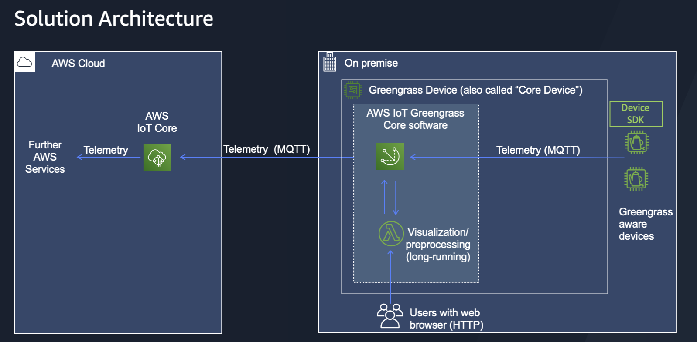
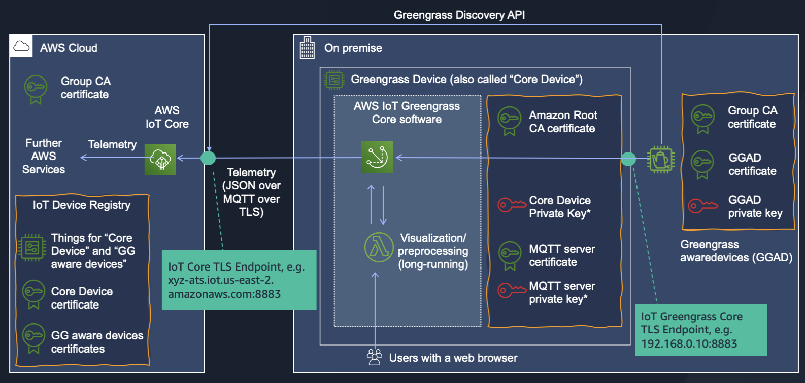
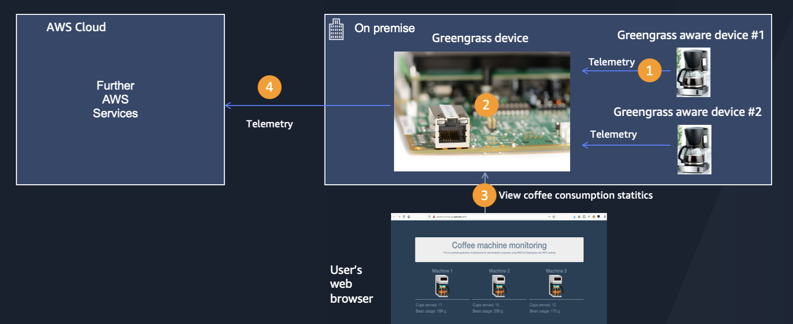
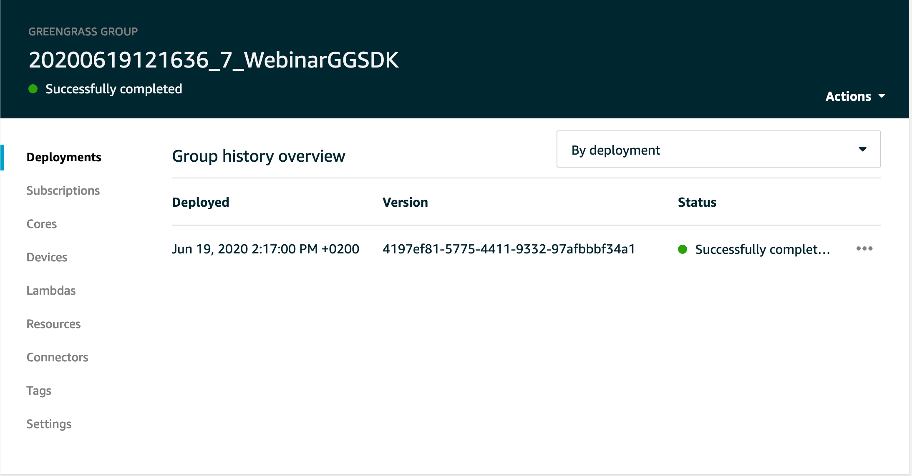
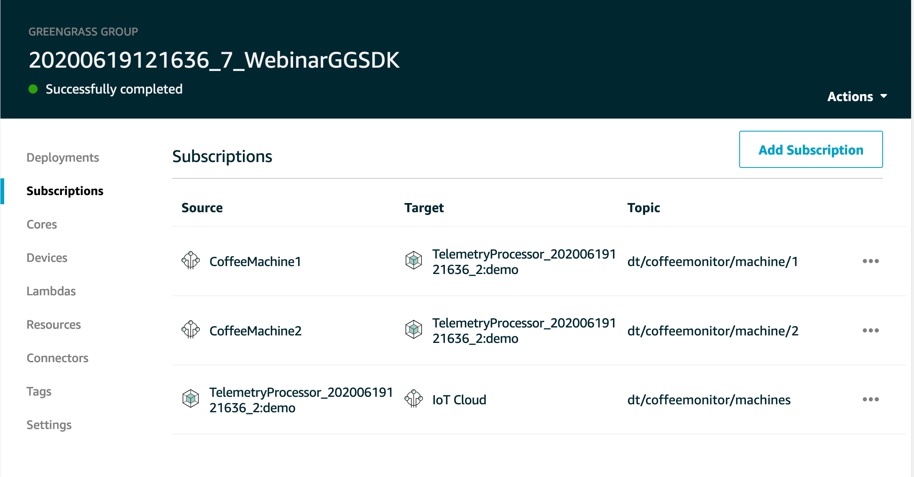
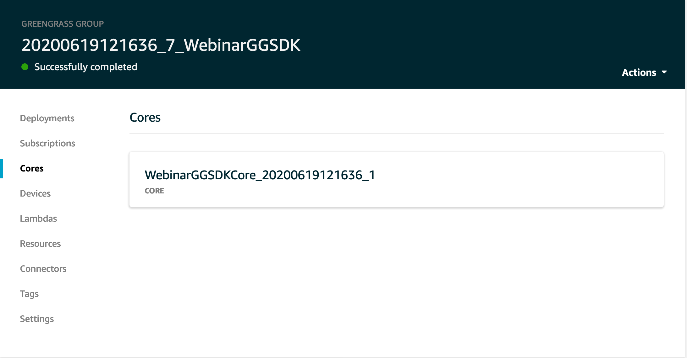
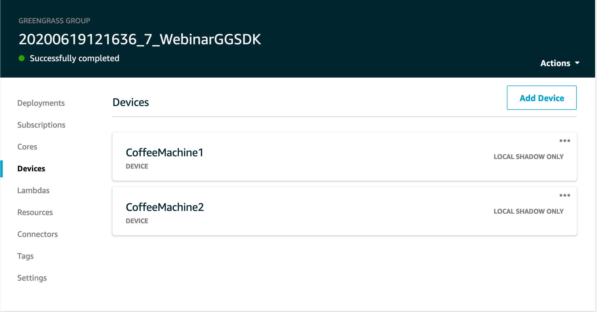
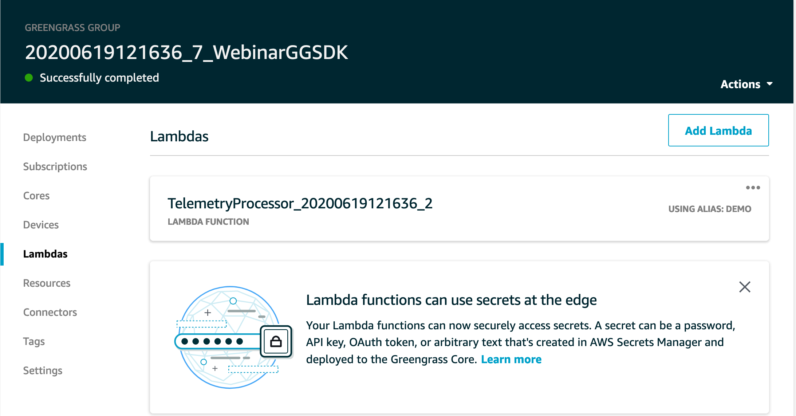
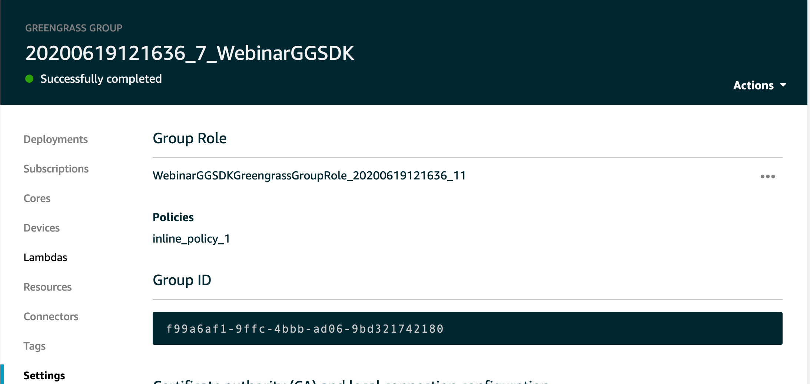
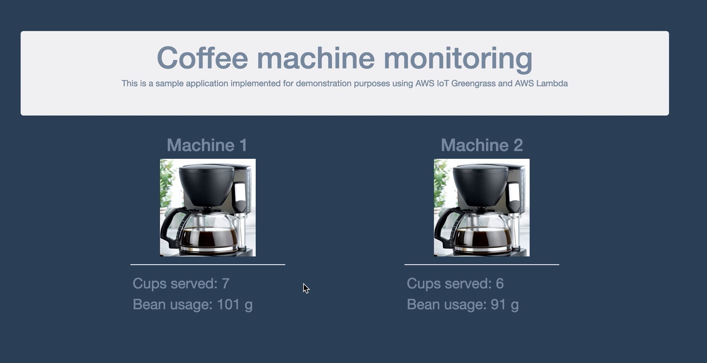

# Managing AWS IoT Greengrass with AWS SDK for Python (Boto3)

This repository demonstrates how to build and deploy an IoT solution based on AWS IoT Greengrass by using AWS SDK for Python (Boto3).

Please note that the following guidelines assume that readers have previous experience with AWS IoT Greengrass.
- If you interested in getting started using AWS IoT Greengrass, please consider [this hands-on tutorial](https://docs.aws.amazon.com/greengrass/latest/developerguide/gg-gs.html)
- If you are looking for a way to automate the AWS IoT Greengrass setup with AWS CloudFormation, please consider [this blog](https://aws.amazon.com/blogs/iot/automating-aws-iot-greengrass-setup-with-aws-cloudformation/). 
- If you are looking for a way to implement a CI/CD pipeline for AWS IoT Greengrass projects, please consider [this blog](https://aws.amazon.com/blogs/iot/implementing-a-ci-cd-pipeline-for-aws-iot-greengrass-projects/)
- If you want to automate AWS IoT Greengrass setup with AWS SDK for Python (Boto3), please read on


When using this code sample, please also consider viewing a recording of a webinar "Create and Manage AWS IoT Greengrass Deployments with AWS SDK for Python (Boto3)" that introduces the related concepts. To request a webinar recording, please use [this link](https://pages.awscloud.com/EMEA-field-OE-IoT-webinar-series-2020-reg-event.html).

# Who this sample is intended for  

The sample is intended for users who already have experience with AWS IoT Greengrass and want to deepen their knowledge in the management of AWS IoT Greengrass groups and deployments. Typical roles targeted by this workshop are Solution Architects and Software Developers.

# When should you consider this sample

Please consider this sample if you are interested in programmatically executing one or more of the following tasks:
* Create and configure an AWS IoT Greengrass Group
  * Create an AWS IoT Greengrass Group Core Thing with an attached certificate and a policy
  * Create and assign a Greengrass Group role
  * Set logging preferences for the AWS IoT Greengrass Group 
* Define and configure AWS Lambda functions to be executed on the AWS IoT Greengrass Core
* Define and configure two common messaging patterns:
  * _Messaging between an edge and a cloud_ : set up subscriptions for communication between an AWS Lambda function and AWS IoT Core 
  * _Messaging on the edge_ : set up subscriptions for communication between two AWS Lambda functions and AWS IoT Core
* Configure an AWS Lambda function on the edge device to invoke another AWS Lambda function
* Configure the AWS IoT Greengrass Core on the edge device
* Deploy an AWS IoT Greengrass group to the AWS IoT Greengrass Core 
* Associate the AWS IoT Greengrass Service role to an AWS account
  

# Solution Architecture
By executing steps in a Jupyter notebook  `notebooks/build_and_deploy_coffee_monitoring_solution.ipynb`, you will set up following resources in your AWS account:



The following figure provides an additional level of detail regarding the resources related to authentication (i.e. X.509 certificates and keys). Please consider the webinar recording for an explanation:


\* Please use secure storage for private keys in any non-prototyping environment, considering the following documentation:
- [Hardware security integration](https://docs.aws.amazon.com/greengrass/latest/developerguide/hardware-security.html)
- [AWS IoT Greengrass core configuration file, specifically “crypto” section](https://docs.aws.amazon.com/greengrass/latest/developerguide/gg-core.html)


# Solution Design
Above mentioned solution architecture will result in a solution with the following functions:


1. Coffee machines publish telemetry data on coffee consumption via MQTT to an AWS IoT Greengrass device
2. The Greengrass device performs visualization of telemetry data from the coffee machines and publishes aggregated telemetry to an AWS cloud
3. Users can view the telemetry data visualization in a web browser.
  


# What resources are available in this repository 
This sample consists of the following parts:
1. A Jupyter notebook in `notebooks/build_and_deploy_coffee_monitoring_solution.ipynb` allows a step-wise execution of the AWS SDK API calls to set up the architecture illustrated above.  __Please note: the explanations below assume the usage of  [Amazon SageMaker notebook instance](https://docs.aws.amazon.com/sagemaker/latest/dg/nbi.html) as a runtime environment for the Jupyter notebook. However, you can also use your own Jupyter runtime for the execution of a code in the Jupyter notebook.__
    
2. An AWS Lambda function to be deployed on a Greengrass device. You will find a source code of that AWS Lambda function in a `coffeemachine_telemetryprocessor` directory. The code for deployment of that AWS Lambda function is included in the Jupyter notebook mentioned above.
3. A script `coffeemachine_devicesimulator/coffemachine_simulator.py` to simulate data ingestion from the coffee machines.

# How to use this sample
Please follow the steps listed below

## Step 1: Prepare a runtime environment for AWS IoT Greengrass Core
Please follow the [AWS IoT Greengrass developer guide](https://docs.aws.amazon.com/greengrass/latest/developerguide/what-is-gg.html) to install an AWS IoT Greengrass Core software on a supported environment, e.g.:
   - [Amazon EC2](https://aws.amazon.com/de/ec2) instance
   - [AWS Cloud9](https://aws.amazon.com/de/cloud9) development environment
   - [Raspberri Pi](https://www.raspberrypi.org) desktop computer

Please ensure that your environment fulfills the following preconditions:
- Python 3.7 is installed 
- Your workstation can access a TCP port 8081 on the environment as a web server will be deployed onto the Greengrass device as a part of this sample

__Note: you can change the port number by adjusting a parameter HTTP_PORT in a file `coffeemachine_telemetryprocessor/src/lambda.py`__


A configuration file, certificate, and private key necessary to start the AWS IoT Greengrass Core will be generated in Step 2 and installed in step 3.

**Please note: storing private keys on a local file system is generally an insecure practice and is done in this code sample only for demonstrational purposes assuming prototypic usage. It should be only used in prototyping environments after a detailed risk analysis. The usage of that approach in any production environment is discouraged. Please use a secure storage for private keys in any non-prototyping environment, considering the following documentation:**
- [Hardware security integration](https://docs.aws.amazon.com/greengrass/latest/developerguide/hardware-security.html)
- [AWS IoT Greengrass core configuration file, specifically “crypto” section](https://docs.aws.amazon.com/greengrass/latest/developerguide/gg-core.html)

 


## Step 2: Create an Amazon SageMaker notebook instance and clone this repository
1. Please follow the [Amazon SageMaker developer guide](https://docs.aws.amazon.com/sagemaker/latest/dg/nbi.html) and create a new Amazon SageMaker notebook instance.  
2. Clone this repository into the local directory on a newly created notebook instance.
3. Please ensure that the IAM Role of the newly created notebook instance has the permissions for creating resources for the following services:
   - AWS Lambda
   - AWS IoT Core
   - AWS IoT Greengrass
   - Amazon SageMaker
   - Amazon CloudWatch
   - AWS IAM

A sample policy with is available under ARN `arn:aws:iam::aws:policy/AmazonSageMakerFullAccess`in AWS IAM. It provides full access to Amazon SageMaker via the AWS Management Console and SDK. It also provides select access to related services (e.g., S3, ECR, CloudWatch Logs). Please review and adjust your policy as necessary.

You may find further information on execution roles for Amazon SageMaker notebooks [here](https://docs.aws.amazon.com/sagemaker/latest/dg/sagemaker-roles.html)


## Step 3: Run sample code for building and deploying an IoT solution
1. Open the Jupyter notebook  `notebooks/build_and_deploy_coffee_monitoring_solution.ipynb`
2. If asked to select a kernel, please choose "conda_python3"
3. Please execute commands in the Jupyter notebook 


## Step 4: Verification

After completion of Parts 1-12  of Jupyter notebook  `notebooks/build_and_deploy_coffee_monitoring_solution.ipynb` please verify your deployment by
1. Open AWS Management Console
2. Select "AWS IoT Core" service
3. Choose "Greengrass" and "Groups"
4. Click on a name of a Greengrass Group (you can see the Group name by executing Part 13 of the Jupyter notebook)
5. Navigate to individual components of the Greengrass Group and compare the configuration to the following sample visuals:
### Deployment

### Subscriptions

### Core

### Devices

### Lambdas

### Settings



### Step 5: Simulate ingestion of telemetry data from the coffee machines
1. Clone this repository on an environment that has a network connectivity to a Greengrass device. You can also use the same runtime environment in which AWS IoT Greengrass Core software was deployed in Step 1.  

``` 
git clone https://github.com/aws-samples/aws-iot-greengrass-boto3
```

2. Change to the directory  `coffeemachine_devicesimulator`  

```
cd coffeemachine_devicesimulator
```

3. Install necessary libraries and dependencies

The following example assumes Ubuntu/Debian Linux, you may need to adjust it for other Linux distributions:

```
python3 -m pip install AWSIoTPythonSDK
sudo apt-get install jq
```

5. Download Amazon root CA certificate 
```
mkdir -p certs
wget -O certs/AmazonRootCA1.pem https://www.amazontrust.com/repository/AmazonRootCA1.pem
```

6. Extract the file <Number>-devices_config.tgz which was created in step 10 of a Jupyter notebook into the `coffeemachine_devicesimulator`  directory.
```
tar xzvf <Number>-devices_config.tgz
```

As a result of this command the following files should be places in the `certs`directory :

```
certs/CoffeeMachine_1.key
certs/CoffeeMachine_2.public.key
certs/CoffeeMachine_1.public.key
certs/CoffeeMachine_2.key
certs/CoffeeMachine_1.pem
certs/CoffeeMachine_2.pem
```

**Please note: storing private keys on a local file system is generally an insecure practice and is done in this code sample only for demonstrational purposes assuming prototypic usage. It should be only used in prototyping environments after a detailed risk analysis. The usage of that approach in production environments is urgently discouraged. Please use a secure storage for private keys in any non-prototyping environment, considering the following documentation:**
- [Hardware security integration](https://docs.aws.amazon.com/greengrass/latest/developerguide/hardware-security.html)
- [AWS IoT Greengrass core configuration file, specifically “crypto” section](https://docs.aws.amazon.com/greengrass/latest/developerguide/gg-core.html)


5. Start the ingestion using the commands you prepared in Step 5 
```
./coffemachine_simulator.sh CoffeeMachine1 certs/CoffeeMachine_1.pem certs/CoffeeMachine_1.key 1
./coffemachine_simulator.sh CoffeeMachine2 certs/CoffeeMachine_2.pem certs/CoffeeMachine_2.key 2
```

### Step 6: Observe the coffee consumption dashboard

1. Ensure that your network allows you TCP connection to the port 8081 of your Greengrass device 
2. Point your browser to the port 8081 of your Greengrass device 
3. Observe the data ingested by the Greengrass aware devices:   



## License

This library is licensed under the MIT-0 License. See the LICENSE file.

